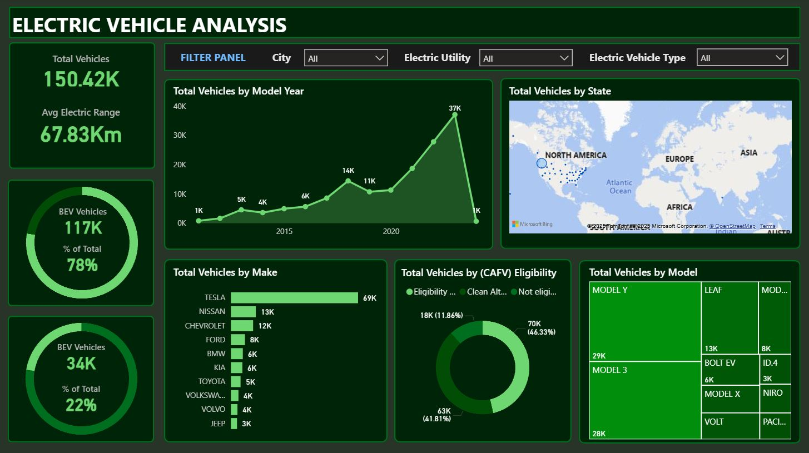

# Electric-Vehicles-Analysis
This project leverages Excel and Power BI to create an interactive analytics dashboard that provides insights into electric vehicle (EV) sales. The analysis focuses on key metrics such as sales by model, city, and EV type (e.g., Battery Electric Vehicles, Plug-in Hybrid Electric Vehicles). The workflow involves using Power Query for data preprocessing and cleaning, followed by data visualization in Power BI. The dashboard includes slicers that seperate data by categories.

 

# Files

 - [Electric_Vehicle_Dashboard.pbix](Electric_Vehicle_Dashboard.pbix): The PowerBI workbook file. This file contains the complete interactive dashboard, including the visualizations and the data source.  
 - [Electric_Vehicle_Population_Data.rar](Electric_Vehicle_Population_Data.rar): The Excel file that holds the cleaned and prepared data. This data has been preprocessed and is ready to be used for visualization.

 

# Insights

- Sales Performance by Model: I identified the top-selling EV models and analyzed their sales trends over time.

- Geographic Sales Trends: I used a map visualization to show the distribution of sales across different cities, highlighting key markets for electric vehicles.

- EV Type Popularity: I analyzed the market share of Battery Electric Vehicles (BEVs) versus Plug-in Hybrid Electric Vehicles (PHEVs) to understand consumer preferences.

 

# Screenshots

  
  

